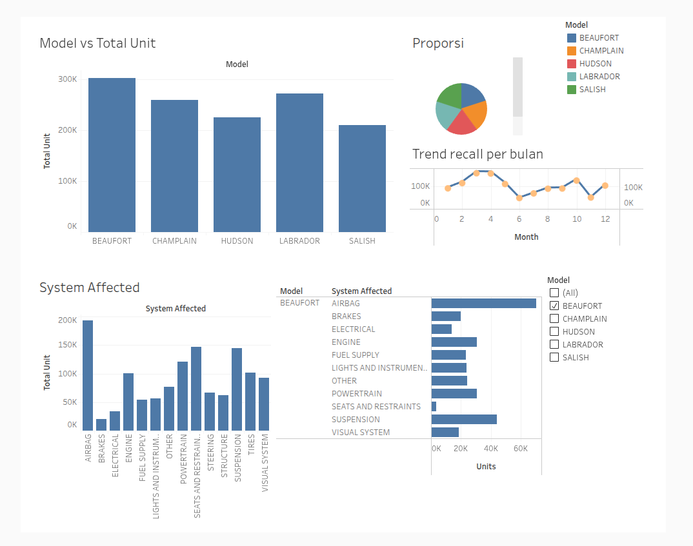

# 🚗 Car Recall Analysis

## 📊 Dashboard Preview

  

## 📌 Deskripsi
Project ini melakukan proses ETL dan visualisasi data recall kendaraan menggunakan Python (Google Colab) dan Tableau.

## ⚙️ Tools
- Python (Pandas)
- Google Colab
- Tableau

## 🔄 Proses
- Extract data dari CSV/Excel
- Data cleaning & transformasi
- Aggregasi data
- Visualisasi menggunakan Tableau

## 📊 Dashboard
🔗 Tableau Public:
https://public.tableau.com/views/CarRecallAnalysisDashboard/AUCarRecalls?:language=en-US&:sid=&:redirect=auth&:display_count=n&:origin=viz_share_link

## 📁 Struktur Project
- notebook: proses ETL
- data: dataset
- output: hasil olahan data

## 🚀 Insight
- Mengidentifikasi model dengan recall tertinggi
- Menemukan sistem paling bermasalah
- Analisis tren recall dari waktu ke waktu# AU-Car-Recalls-Analysis
